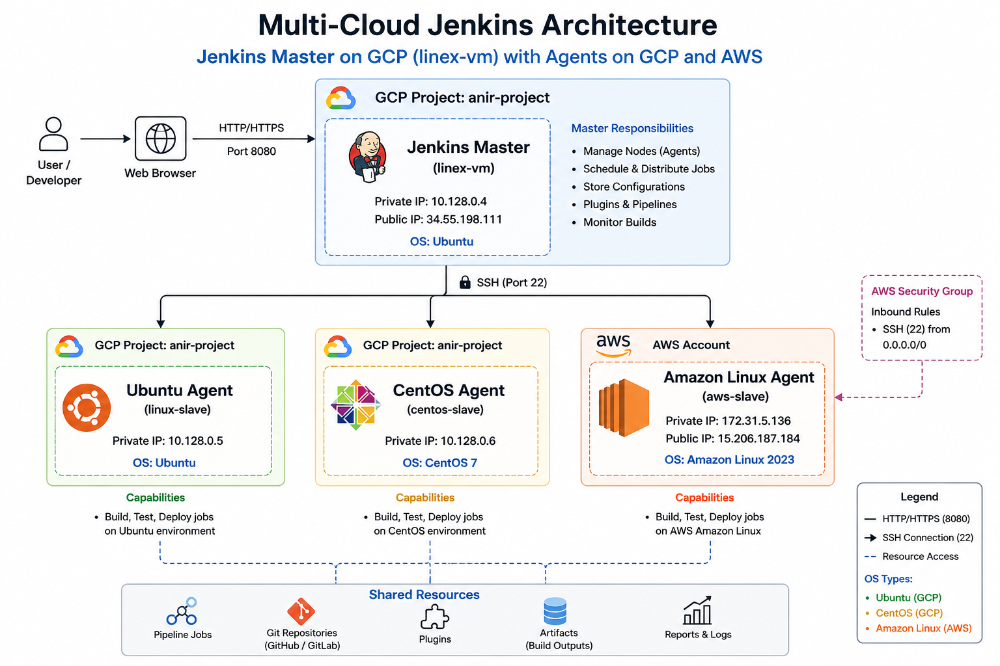

# 🚀 Multi-Cloud Jenkins Master-Agent Architecture

<p align="center">
  <b>GCP Master + Multi-OS Agents (GCP & AWS)</b><br/>
  Production-style distributed CI/CD setup
</p>

---

## 🧱 Architecture

```text
GitHub (Code Push)
        ↓
Webhook Trigger
        ↓
Jenkins Master (GCP)
        ↓
Parallel Execution
        ├── Ubuntu Agent (GCP)
        ├── CentOS Agent (GCP)
        └── Amazon Linux Agent (AWS)
        ↓
         → Artifact
```




---

## ⚡ Highlights

* 🌐 **Multi-Cloud Setup** → GCP + AWS
* 🧠 **Master-Agent Architecture**
* 🔐 **Passwordless SSH Authentication**
* 🖥️ **Multi-OS Agents** → Ubuntu, CentOS, Amazon Linux
* ⚙️ **Distributed Job Execution**
* 🧪 **Real-world Troubleshooting**

---

## 🧩 Infrastructure Overview

| Component      | Cloud | OS           | Role                  |
| -------------- | ----- | ------------ | --------------------- |
| Jenkins Master | GCP   | Ubuntu       | Control Plane         |
| Agent 1        | GCP   | Ubuntu       | Build Node            |
| Agent 2        | GCP   | CentOS       | Test Node             |
| Agent 3        | AWS   | Amazon Linux | Cross-cloud Execution |

---

## 🔄 Workflow

```text
Developer → GitHub → Jenkins Master → Agents → Build Execution
```

---

## 🧪 Sample Distributed Pipeline

```groovy
pipeline {
    agent none

    stages {
        stage('Ubuntu Build') {
            agent { label 'linux' }
            steps {
                sh 'echo "Running on Ubuntu"; hostname'
            }
        }

        stage('CentOS Test') {
            agent { label 'centos' }
            steps {
                sh 'echo "Running on CentOS"; hostname'
            }
        }

        stage('AWS Deploy') {
            agent { label 'aws' }
            steps {
                sh 'echo "Running on AWS"; hostname'
            }
        }
    }
}
```

---

## 🔐 Security

* SSH key-based authentication
* AWS Security Group (Port 22)
* Restricted node execution via labels

---

## ⚠️ Challenges & Fixes

| Issue                 | Solution                            |
| --------------------- | ----------------------------------- |
| SSH Permission Denied | Fixed authorized_keys + permissions |
| Agent Offline         | Installed Java on nodes             |
| CentOS Failure        | Resolved SELinux restrictions       |
| AWS Connection        | Configured Security Groups          |

---

## 📸 Screenshots

(Add Jenkins UI screenshots here)

---
## 💡 Why this project?

Most tutorials stop at single-node Jenkins.  
This project simulates a **real-world enterprise setup** with:

- Distributed execution
- Multi-cloud integration
- OS-level diversity

## 🧠 Key Learnings

* Distributed CI/CD architecture
* Cross-cloud networking
* OS-level differences (apt vs dnf)
* Debugging real infra issues

---

## 👨‍💻 Author

**Anirban Dalui**
DevOps | Cloud | Automation

## 🔎 Tags

Jenkins, DevOps, CI/CD, GCP, AWS, EC2, Compute Engine, Automation, SSH, Multi-Cloud
